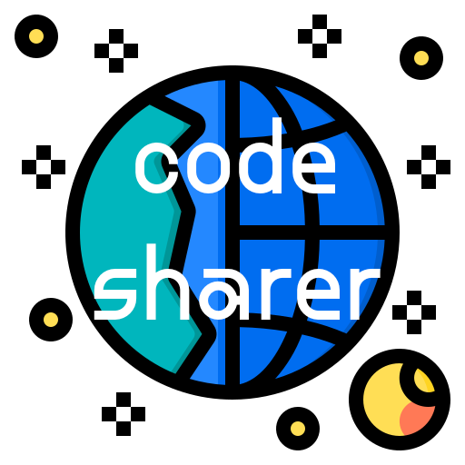

 Share colorful snippets of your code.

<h1> Code Sharer </h1>

 Code Sharer is a website that allows programmers to share colorful snippets of code. It's basically <a href="gist.github.com/">Github Gists</a>, but with color.

<h2> Using Code Sharer </h2>

To use Code Sharer, follow these steps:

<ul>
<li> Visit the <a href="https://codesharer.netlify.app">site</a>. </li>
<li> Type your code snippet into the given text box. </li>
<li> When you're done, click the share button and the share link will be copied to your clipboard! </li>
</ul>

<h2> Contributing to Code Sharer for Hacktoberfest </h2>

Look at the <a href="https://github.com/genderev/code-sharer/issues">open issues</a>! There are issues tagged with "hacktoberfest" that make it easy for you to get started contributing.

Another option is to open this repo in Gitpod and start editing:

Alternatively, follow these steps:

<ol>
<li> Fork this repository. </li>
<li> Create a branch: <code>git checkout -b <branch_name></code>. </li>
<li> Make your changes and commit them: <code>git commit -m '<commit_message>'</code> </li>
<li> Push to the original branch: <code>git push origin <project_name>/<location></code> </li>
<li> Create the pull request. </li>
</ol>

<h3> License </h3>

This project uses the <a href="https://github.com/genderev/code-sharer/blob/master/LICENSE.md">MIT license</a>.

<h3> Credit </h3>
<a href="https://www.flaticon.com/authors/phatplus">Icon Source</a>
